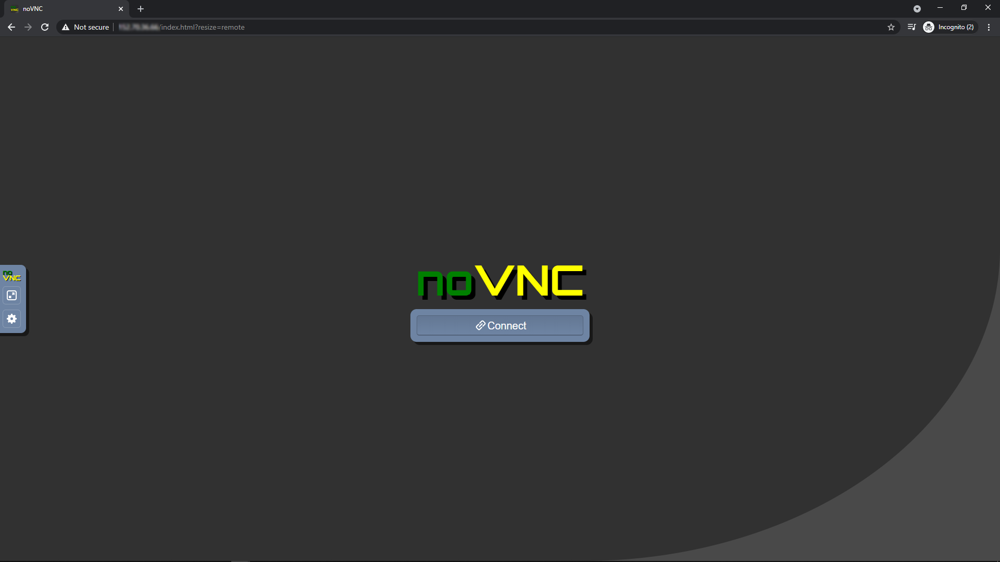
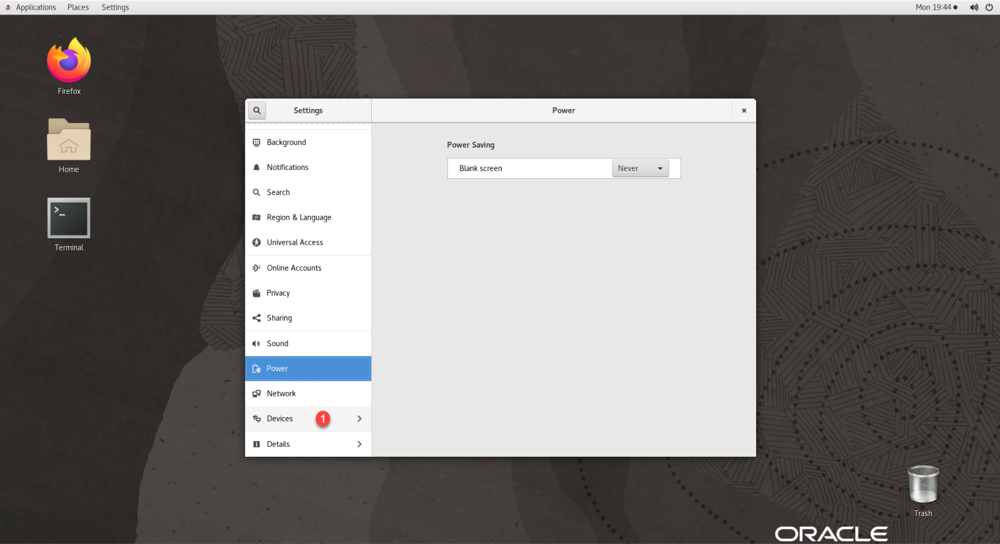
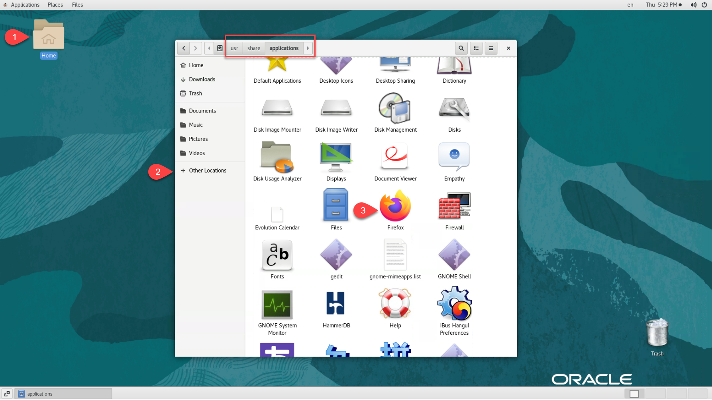
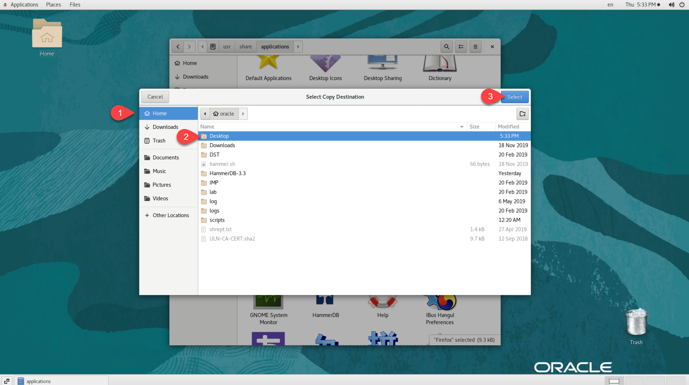
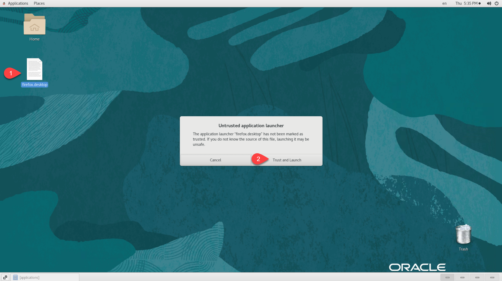
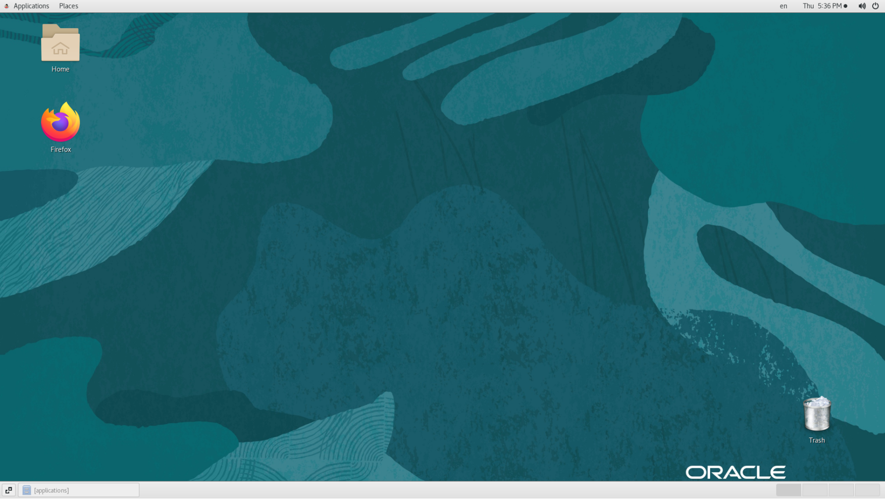

# Setup Graphical Remote Desktop

## Introduction
This lab will show you how to deploy and configure noVNC Graphical Remote Desktop on an Oracle Enterprise Linux (OEL) instance prior
to capturing .

### Objectives
- Deploy NoVNC Remote Desktop
- Configure Desktop
- Add Applications Shortcuts to Desktop
- Configure remote clipboard
- Enable VNC password reset

### Prerequisites
This lab assumes you have:
- An Oracle Enterprise Linux (OEL) that meets requirement for marketplace publishing

## **STEP 1**: Deploy noVNC
1.  As root, create script */tmp/set-os-user.sh* to perform the first set of tasks.

    ```
    <copy>
    sudo su - || sudo sed -i -e 's|root:x:0:0:root:/root:.*$|root:x:0:0:root:/root:/bin/bash|g' /etc/passwd; sudo su -

    </copy>
    ```

    ```
    <copy>
    cat > /tmp/set-os-user.sh <<EOF
    #!/bin/bash
    echo ""
    echo "Your input is required!"
    echo ""
    read -p 'Press *ENTER* to Accept *oracle* as the OS user to configure for remote desktop access or type in another valid user. If no input is provided *oracle* is assumed: ' appuser

    appuser=\${appuser:-oracle}

    getent passwd \$appuser > /dev/null

    if [ $? -eq 0 ]; then
      if [[ \${appuser} == root ]]; then
         echo ""
         echo "***ERROR****"
         echo "-- Not allowed for root. -- VNC must be on a non-root account. e.g oracle. Please start over and enter a valid non-root OS user when prompted"
         echo ""
         exit 20
      fi
       echo \$appuser >/tmp/.appuser
    else
        echo ""
        echo "***ERROR****"
        echo "-- Invalid OS user. -- Please start over and enter a valid non-root OS user when prompted"
        echo ""
    fi
    EOF
    chmod +x /tmp/set-os-user.sh

    </copy>
    ```

2.  Run */tmp/set-os-user.sh* to set the OS user to be configured for remote desktop access. The default user is *oracle*.

    ```
    <copy>
    /tmp/set-os-user.sh
    </copy>
    ```

3. Create script */tmp/novnc-1.sh* to perform the first set of tasks.

    ```
    <copy>
    export appuser=$(cat /tmp/.appuser)
    cat > /tmp/novnc-1.sh <<EOF
    #!/bin/bash

    if [[ -z "\${appuser}" ]]; then
      echo "A valid OS user must be provided. e.g. oracle "
      exit 10
      if [[ \${appuser} == root ]]; then
        echo "Not allowed for root. VNC must be on non root account. e.g oracle"
        exit 20
      fi
    fi

    echo "Proceeding with configuration for OS user \$appuser"

    echo "Installing X-Server required packages ..."
    yum -y groupinstall "Server with GUI"

    echo "Installing other required packages ..."
    yum -y install \
    tigervnc-server \
    numpy \
    mailcap

    yum -y localinstall \
    http://mirror.dfw.rax.opendev.org:8080/rdo/centos7-master/deps/latest/noarch/novnc-1.1.0-6.el7.noarch.rpm \
    http://mirror.dfw.rax.opendev.org:8080/rdo/centos7-master/deps/latest/noarch/python2-websockify-0.8.0-13.el7.noarch.rpm

    echo "Updating VNC Service ..."
    cp /lib/systemd/system/vncserver@.service /etc/systemd/system/vncserver_\${appuser}@:1.service
    sed -i "s/<USER>/\${appuser}/g" /etc/systemd/system/vncserver_\${appuser}@:1.service
    sed -i "s/After=syslog.target network.target/After=syslog.target network.target resetvncpwd.service/g" /etc/systemd/system/vncserver_\${appuser}@:1.service

    firewall-cmd --zone=public --permanent --add-service=vnc-server
    firewall-cmd --zone=public --permanent --add-port=5901/tcp
    firewall-cmd --permanent --add-port=6080/tcp

    firewall-cmd  --reload

    systemctl daemon-reload
    systemctl enable vncserver_\${appuser}@:1.service
    systemctl daemon-reload

    EOF
    cat >/usr/local/bin/resetvncpwd.sh <<EOF
    #!/bin/bash
    # Reset VNC password for user

    mypasswd=\$(curl -s -H "Authorization: Bearer Oracle" -L http://169.254.169.254/opc/v2/instance/metadata/vncpwd)

    if [[ \${#mypasswd} -ne 10  ]]; then
      echo "Required Random password string is missing from OCI metadata. No VNC password reset for user ${appuser} will be performed"
      exit 30
    else
      echo \$mypasswd | vncpasswd -f >/home/${appuser}/.vnc/passwd
      chmod 0600 /home/${appuser}/.vnc/passwd
      echo "VNC password for user ${appuser} reset successfully"
    fi
    EOF
    cat > /etc/systemd/system/websockify.service <<EOF
    [Unit]
    Description=Websockify Service
    After=network.target cloud-final.service

    [Service]
    Type=simple
    User=${appuser}
    ExecStart=/bin/websockify --web=/usr/share/novnc/ --wrap-mode=respawn 6080 localhost:5901
    Restart=on-abort

    [Install]
    WantedBy=multi-user.target
    EOF
    cat > /etc/systemd/system/resetvncpwd.service <<EOF
    [Unit]
    Description=ResetVncPwd Service
    After=syslog.target network.target

    [Service]
    Type=simple
    ExecStart=/usr/local/bin/resetvncpwd.sh ${appuser}

    [Install]
    WantedBy=multi-user.target
    EOF

    chmod +x /usr/local/bin/resetvncpwd.sh
    chmod +x /tmp/novnc-*.sh
    </copy>
    ```

4. Create script */tmp/novnc-2.sh* to perform the second set of tasks.

    ```
    <copy>
    cat > /tmp/novnc-2.sh <<EOF
    #!/bin/bash

    #Enable and Start services

    systemctl daemon-reload
    systemctl enable websockify.service
    systemctl start websockify.service
    systemctl enable resetvncpwd.service
    systemctl start resetvncpwd.service

    echo "noVNC has been successfully deployed on this host. Open the browser and navigate to the URL below to validate"
    echo ""
    echo "#================================================="
    echo "#"
    echo "# http://`curl -s ident.me`:6080/index.html?resize=remote"      
    echo "# or"
    echo "# http://`curl -s ident.me`:6080/index.html?password=LiveLabs.Rocks_99&resize=remote&autoconnect=true"      
    echo "#================================================="
    echo ""
    EOF
    chmod +x /tmp/novnc-*.sh
    </copy>
    ```

5. Ensure that the *EPEL* Yum Repo is configured and enabled. i.e. contains the entry *enabled=1*. If not, update it accordingly before proceeding with the next step

    ```
    <copy>
    sed -i -e 's|enabled=.*$|enabled=1|g' /etc/yum.repos.d/oracle-epel-ol7.repo
    cat /etc/yum.repos.d/oracle-epel-ol7.repo|grep enable
    </copy>
    ```

    

6. Run script *novnc-1.sh* with the desired VNC user as the sole input parameter. e.g. *oracle*

    ```
    <copy>
    /tmp/novnc-1.sh
    </copy>
    ```

7.  Set password for VNC user.

    ```
    <copy>
    vncpasswd ${appuser}
    </copy>
    ```

8. Provide password as prompted. e.g. "*LiveLabs.Rocks_99*". When prompted with *Would you like to enter a view-only password (y/n)?*, enter **N**

    ```
    <copy>
    LiveLabs.Rocks_99
    </copy>
    ```

9. Su over to the VNC user account and enforce the password.  when prompted

    ```
    <copy>
    sudo su - ${appuser}
    vncserver
    </copy>
    ```

10. Provide the same password as you did above. e.g. "*LiveLabs.Rocks_99*". When prompted with *Would you like to enter a view-only password (y/n)?*, enter **N**

    ```
    <copy>
    LiveLabs.Rocks_99
    </copy>
    ```

11. Stop the newly started VNC Server running on "**:1**" and exit (or *CTRL+D*) the session as vnc user to go back to *root*

    ```
    <copy>
    vncserver -kill :1
    exit
    </copy>
    ```

12. Start VNC Server using *systemctl*

    ```
    <copy>
    systemctl start vncserver_${appuser}@:1.service
    systemctl status vncserver_${appuser}@:1.service
    </copy>
    ```
13. Run script *novnc-2.sh* to finalize

    ```
    <copy>
    /tmp/novnc-2.sh
    </copy>
    ```

14. After validating successful setup from URL displayed by above script, remove all setup scripts from "*/tmp*"

    ```
    <copy>
    rm -rf /tmp/novnc-*.sh
    rm -rf /tmp/set-os-user.sh
    </copy>
    ```

## **STEP 2**: Configure Desktop   
LiveLabs compute instance are password-less and only accessible via SSH keys. As result it's important to adjust session settings some settings to ensure a better user experience.

1. Launch your browser to the following URL

    ```
    <copy>http://[your instance public-ip address]:6080/index.html?resize=remote</copy>
    ```

    


2. Copy/Paste the Password below to login

    ```
    <copy>LiveLabs.Rocks_99</copy>
    ```

    

3. Navigate to "*Applications >> System Tools >> Settings*"

    

4. Click on "*Privacy*" and set **Screen Lock** to *Off*

    

5. Click on "*Power*" and set **Blank Screen** under Power Saving to *Never*

    

6. Click on "*Notifications*" and set **Notifications Popups** and **Lock Screen Notifications** to *Off*

    

7. Scroll-down, Click on "*Devices >> Resolution*" and select **1920 x 1080 (16:9)**

    
    

## **STEP 3**: Add Applications to Desktop   
For ease of access to desktop applications provided on the instance and needed to perform the labs, follow the steps below to add shortcuts to the desktop. In the example below, we will be adding a shortcut of *FireFox* browser.

1. On the desktop from the previous setup, click on *Home > Other Locations*, then navigate to *`/usr/share/applications`* and scroll-down to find *FireFox*

    

2. Right-click on *FireFox* and select *Copy to...*

    

3. Navigate to *Home > Desktop* and Click on *Select*

    

4. Double-click on the newly added icon on the desktop and click on *Trust and Launch*

    
    

5. Repeat steps above to add any other required Application the workshop may need to the Desktop (e.g. Terminal, SQL Developer, etc...)

    

## **STEP 4**: Enable Copy/Paste from Local to Remote Desktop (noVNC clipboard)
Perform the tasks below and add them to any workshop guide to instruct users on how to enable clipboard on the remote desktop for local-to-remote copy/paste.

During the execution of your labs you may need to copy text from your local PC/Mac to the remote desktop, such as commands from the lab guide. While such direct copy/paste isn't supported as you will realize, you may proceed as indicated below to enable an alternative local-to-remote clipboard with Input Text Field.

1. From your remote desktop session, click on the small gray tab on the middle-left side of your screen to open the control bar

    

2. Select the *clipboard* icon, Copy the sample text below and paste into the clipboard widget, then finally open up the desired application and paste accordingly using *mouse controls*

    ```
    <copy>echo "This text was copied from my local computer"</copy>
    ```

    

    *Note:* Please make sure you initialize your clipboard with steps *[1-3]* shown above before opening the target application in which you intend to paste the text. Otherwise will find the *paste* function grayed out in step 4 when attempting to paste.

## **STEP 5**: Enable VNC Password Reset for each instance provisioned from the image
For added security, update your Terraform/ORM stack with the tasks below to enable VNC password reset for each VM provisioned from the image.

1. Add provider *random* to *main.tf* or and any other *TF* file in your configuration if you not using *main.tf*

    ```
    <copy>
    terraform {
      required_version = "~> 0.13.0"
    }

    provider "oci" {
      tenancy_ocid = var.tenancy_ocid
      region       = var.region
    }

    provider "random" {}
    </copy>
    ```
2. Add a *random* resource in your *instance.tf* or any *TF* of your choice to generate a 10 characters random password with a mix of Number/Uppercase/Lowercase characters.

    ```
    <copy>
    resource "random_string" "vncpwd" {
      length  = 10
      upper   = true
      lower   = true
      number  = true
      special = false
    }
    </copy>
    ```

3. Add *`random_string`* result to the metadata property for resource *`oci_core_instance`*. This will store the random value generated above as part of the instance metadata that can be queried at any time to reset VNC Password.

    ```
    <copy>
    metadata = {
      ssh_authorized_keys = var.ssh_public_key
      vncpwd              = random_string.vncpwd.result
    }
    </copy>
    ```

4. Add the entry *`remote_desktop`* to your *output.tf* to provide the single-click URL for remote desktop access with auto resizable window and auto-login. Replace [instance-name] from the snippet below with your real instance name as provided the resource *`oci_core_instance`* block of *instance.tf*

    ```
    <copy>
    output "remote_desktop" {
      value = format("http://%s%s%s%s",
        oci_core_instance.[instance-name].public_ip,
        ":6080/index.html?password=",
        random_string.vncpwd.result,
        "&resize=remote&autoconnect=true"
      )
    }
    </copy>
    ```
5. Add output entry *`remote_desktop`* to your *schema.yaml* file

    ```
    <copy>
    outputGroups:
      - title: Resources Access Information
        outputs:
          - ${remote_desktop}

    outputs:
      remote_desktop:
        type: string
        title: Remote Desktop
        visible: true

    </copy>
    ```
6. Test out your ORM Stack and verify the output for *`remote_desktop`* as shown below

    

7. From to the *Application Information Tab* as shown above, click on the single-click URL to test it out.

    

    **Note:** Your source image instance is now configured to generate a random VNC password for every instance created from it, provided that the provisioning requests include the needed metadata storing the random string.

You may now [proceed to the next lab](#next).

## Acknowledgements
* **Author** - Rene Fontcha, LiveLabs Platform Lead, NA Technology, September 2020
* **Contributors** - Robert Pastijn
* **Last Updated By/Date** - Rene Fontcha, LiveLabs Platform Lead, NA Technology, May 2021
